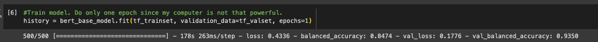
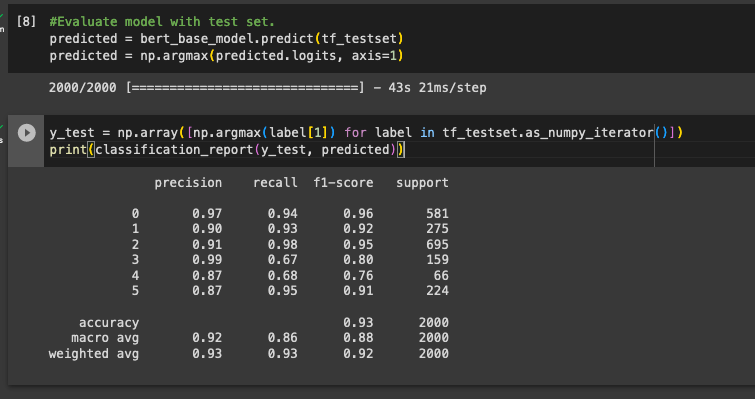

# TWEET to EMOJI.

This is my take-home test submission for the Data Scientist position at Glia.

The test consisted of creating a multi-class classification NLP model using a publicly avaiable dataset. Then, make it available through a REST API.

I'm using the Kaggle dataset [Emotions dataset for NLP](https://www.kaggle.com/datasets/praveengovi/emotions-dataset-for-nlp) which consists of 20k Tweets to 6 different emojis.

## Content
1. Dataset exploration.
2. Model training and evaluation.
3. REST API
4. Docker

### I. Data Exploration

This section is straight forward. First, make sure to have a python virtual environment and install the requirements.file

From the new environment:
```bash
pip install -r requirements.txt
```
Then, using Jupyter-lab (or notebook) load the Playground.ipynb file and run the cells.
This notebook contain the approach taken to explore the dataset and clean it.

### II. Model training an evaluation

The proposed model takes a text (tweet) and returns the most fitting emoji. I used pre-trained BERT models to experiment with fine-tuning and transfer learning.

The best model (Fine-tuned TFDistilBertForSequenceClassification) achieved a balanced accuracy of 93% on the validation set:



And good F1-score across all classes on the test set.



Similar to the previos section, I used two notebooks:
* Fine_tune_Bert_GCLB
* Transfer_learning_BERT_GCLB

Both were run on Google Colab using the T4 GPU. If you want to run them locally, make sure you have installed the requirements.txt and use Jupyter-lab (or notebook).

The results for the transfer learning model can be found on the *"/screens"* directory of on the Transfer_learning_BERT_GCLB.

### III. REST API

The resulting model is exposed through a Flask REST API. A GET request is sent to "tweets" end-point with the following format:

#### GET REQUEST
```json
{
    "text": "Today is a good day!
}
```
#### RESPONSE
```json
{
    "confidence": "0.9963295",
    "emoji": "😂"
}
```

If want to run the API locally you have to first train the model (run the Fine_tune_Bert_GCLB notebook) and save both the tokenizer and model in the *"/emoji_api/models/tf_bert_sequence_tok"* and *"/emoji_api/models/tf_bert_sequence"* correspondingly. 

**MODELS ARE NOT INCLUDED IN THE REPO SINCE THEY ARE BIGGGER THEN 100MB. IS EASIER TO DOWNLOAD AND RUN THE PROVIDED DOCKER CONTAINER WITH THE FINE-TUNED MODELS**

Then, install the requirements on *"/emoji_api/requirements.txt"* (which includes Flask) and then run Flask from within *"/emoji_api"*:
```bash
flask run
```

Once Flask is running, you can send your request to: 
```
http:localhost:<YOUR_PORT>/tweets
```
Also, you can look at the description of the API thanks to OpenAPI & swagger UI:
```
http:localhost:<YOUR_PORT>/swagger-ui
```

### III. Docker

Finally the API is containerized on docker container. The image can be downloaded from Docker Hub: 

https://hub.docker.com/r/geramantecon/emojiapi_takehome

**THIS IS THE BEST WAY TO TRY THE API AS IT CONTAINS THE TRAINED MODEL!**

Then run it:
```bash
docker run -dp 5005:5000 emojiapi_takehome
```

If this is not possible, we can build it from within the "emoji_app" (Dockerfile is there) directory using:
```bash
docker build -t <YOU_IMAGE_NAME> .
```
Then run:
```bash
docker run -dp 5005:5000 <YOU_IMAGE_NAME>
```